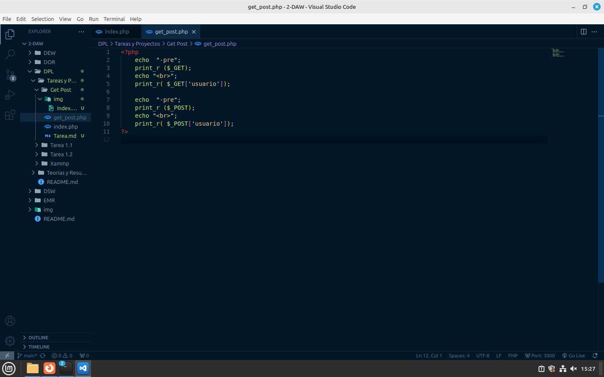
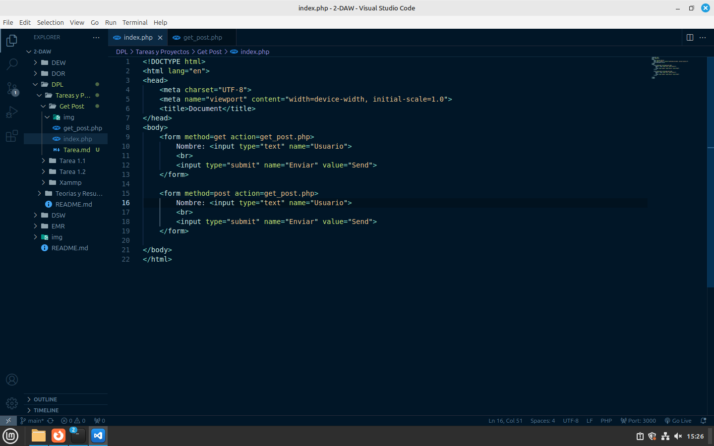

# Guía Paso a Paso para Métodos GET y POST

## Paso 1: Implementación del Método GET y POST en PHP


En la primera imagen, se muestra un script PHP que maneja una solicitud GET. El código obtiene datos enviados a través del método GET y los imprime.

## Paso 2: Creación de un Formulario HTML para GET


La segunda imagen muestra un formulario HTML que envía datos utilizando el método GET. Este formulario tiene campos para “Nombre” y “Apellido”.

## Paso 3: Navegación y Ejecución de Servicios en XAMPP

 
En la tercera imagen, se muestra la ejecución de comandos en la terminal para iniciar servicios de XAMPP y navegar por directorios.

```bash
sudo /opt/lampp/lampp start
cd /opt/lampp/htdocs
```
## Paso 4: Configuración del Entorno


Para entrar en la configuración del entorno de desarrollo utilizando XAMPP en una máquina virtual. Aquí se copian archivos PHP desde el escritorio a la carpeta `htdocs` de XAMPP.

```bash
sudo cp /home/usuario/Escritorio/2-DAW/DPL/Tareas\ y\ Proyectos/Get\ Post/get_post.php /opt/lampp/htdocs/
```
## Paso 5: Comprobacion de resultados

Tras todo esto entramos en nuestro localhost y se nos mostrara el index creado y al dar a alguno de los botones se ejecutara el codigo php, dando como resultado los siguientes

Metodo Get:


Metodo Post:


##### Creado Por César Domínguez Romero 

