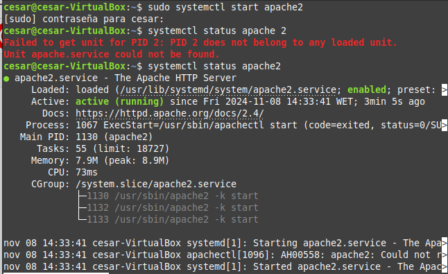

## Instalación y Configuración de Apache y Tomcat

# Apache

#### Paso 1: Actualización de Repositorios

```bash

sudo apt update
```
Actualiza la lista de paquetes disponibles
Asegura que se instalen las últimas versiones
Prepara el sistema para la instalación


#### Paso 2: Instalación de Apache

```bash

sudo apt install apache2

```
Descarga e instala el servidor web Apache
Instala dependencias necesarias
Configura servicios básicos


#### Paso 3: Verificación del Servicio

```bash

sudo systemctl status apache2
```
Comprueba el estado del servicio Apache
Muestra si está activo y funcionando
Proporciona información de diagnóstico



#### Paso 4: Configuración Básica


Ubicación de archivos de configuración: /etc/apache2/
Archivos principales:
- apache2.conf: Configuración global
- sites-available/: Configuración de sitios web
- mods-available/: Módulos de Apache


#### Paso 5: Prueba de Funcionamiento

Abrir navegador en http://localhost
Muestra página por defecto de Apache
Confirma instalación correcta

# Tomcat


#### Paso 1: Instalación de Java (Requisito previo)

```bash

sudo apt install default-jdk
```
Instala el Java Development Kit
Necesario para ejecutar aplicaciones Java
Configura variables de entorno de Java


#### Paso 2: Descarga de Tomcat

```bash

wget https://downloads.apache.org/tomcat/tomcat-9/v9.0.x/bin/apache-tomcat-9.0.x.tar.gz
```
Descarga el archivo de instalación de Tomcat
Selecciona versión específica
Utiliza wget para descargar desde repositorio oficial

#### Paso 3: Extracción de Tomcat

```bash

sudo tar xzvf apache-tomcat-9.0.x.tar.gz -C /opt/
```
Extrae archivos de Tomcat
Ubica en directorio /opt/
Crea estructura de directorios

#### Paso 4: Configuración de Usuarios

Editar conf/tomcat-users.xml
Agregar usuarios para manager-gui
Configurar roles de administración

#### Paso 5: Configuración de Servicio Systemd

Crear archivo /etc/systemd/system/tomcat.service
Configurar inicio automático
Definir usuario y grupo de ejecución

#### Paso 6: Inicio y Verificación de Tomcat

```bash

sudo systemctl start tomcat

sudo systemctl status tomcat
```
Inicia servicio de Tomcat
Verifica estado de funcionamiento
Comprueba logs de inicio

#### Paso 7: Configuración de Firewall

```bash

sudo ufw allow 8080
```
Abre puerto 8080 para Tomcat
Permite acceso desde red local/internet
Configura reglas de firewall

#### Paso 8: Acceso a Interfaz de Administración

Abrir navegador en http://localhost:8080
Verificar página de inicio de Tomcat
Probar acceso a manager-gui

Configuraciones Adicionales
Apache

Habilitar módulos:

```bash

sudo a2enmod rewrite

sudo a2enmod ssl
```
Crear sitios virtuales
Configurar hosts virtuales

Tomcat

Configurar contextos
Implementar aplicaciones WAR
Configurar conectores HTTPS

Consideraciones de Seguridad

Actualizar regularmente
Configurar usuarios con permisos mínimos
Usar firewall
Deshabilitar servicios no utilizados

Gestión de Servicios

```bash

# Apache

sudo systemctl start/stop/restart apache2

sudo systemctl enable apache2


# Tomcat

sudo systemctl start/stop/restart tomcat

sudo systemctl enable tomcat
```