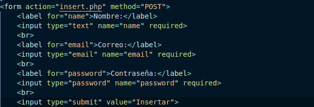
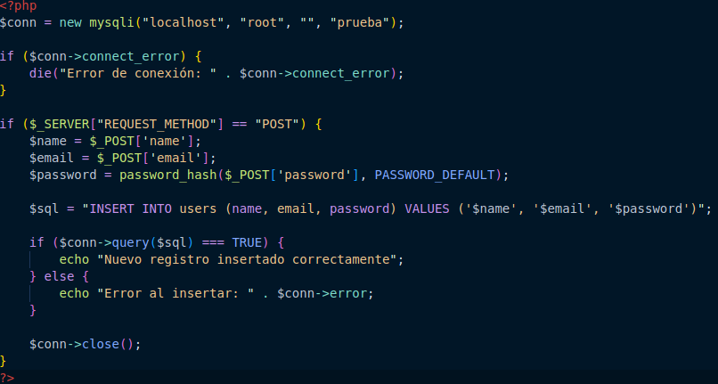
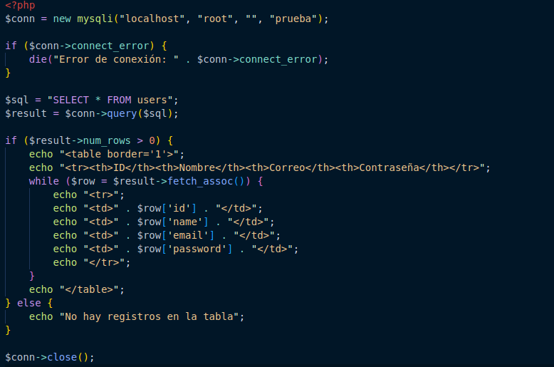
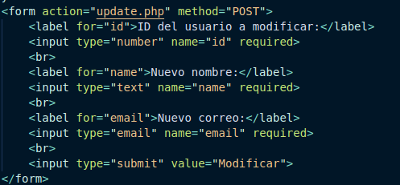
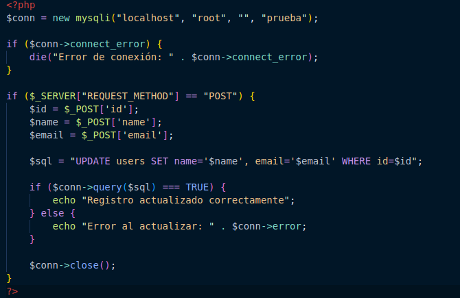
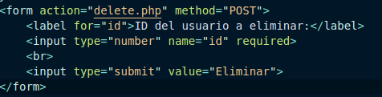
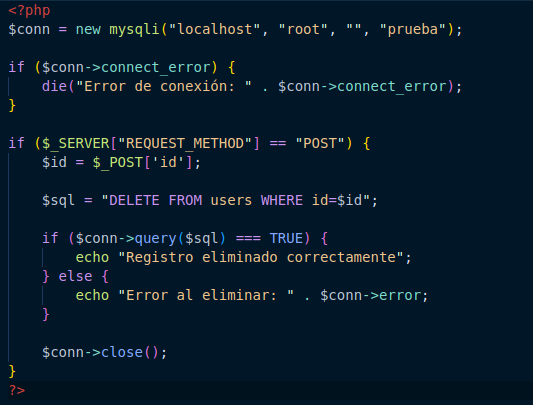

# Insertar, leer, modificar y borrar registros de la base de datos

Este informe describe los pasos necesarios para realizar las cuatro operaciones básicas en una base de datos: insertar, leer, modificar y borrar utilizando PHP para interactuar con la base de datos a través de phpMyAdmin. La base de datos de ejemplo se llamará **prueba** y la tabla sobre la que operaremos es **users**.

### 1. Insertar registros

Para agregar un nuevo usuario a la tabla **users**, se requiere un formulario HTML y un script PHP que procese los datos ingresados. El siguiente código inserta un nuevo registro en la tabla.

!Formulario HTML

!Script PHP

### 2. Leer Registros

Para leer todos los registros de la tabla **users**, ejecutamos una consulta SQL que muestre los datos en formato de tabla HTML.

### 3. Modificar Registros

Para modificar un registro necesitamos capturar el **id** del usuario a modificar, y luego actualizar los valores de **name** y **email**.

!Formulario HTML

**Script PHP:**

### 4. Borrar Registros

Para eliminar un registro, es necesario especificar el **id** del usuario que se desea borrar.

**Formulario HTML:**

**Script PHP:**

##### Creado Por César Domínguez Romero 