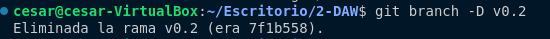

# Tarea 2 de Git 

## RAMAS

Para crear una rama se utilizan los siguientes comandos

Nos situamos en la rama y creamos un archivo 

Despues utilizamos el comando Git merge v0.2 para fusionar las ramas 

Despues desde cada una de las ramas modificamos un archivo y hacemos commit creando un conflicto el cual se resuelve haciendo un merge de las ramas.

Listamos las ramas con merge

Creamos el tag con git tag -a -m y borramos la rama con git branch -d

hacemos un git log para ver los cambios y sus tags 

## ORGANIZACIONES 

