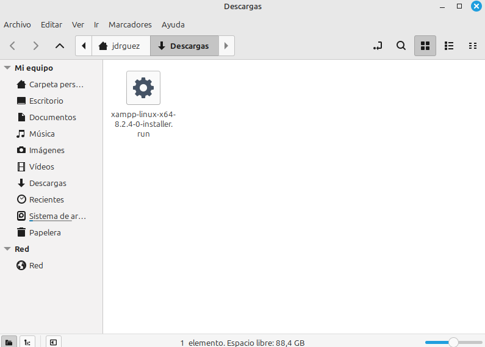
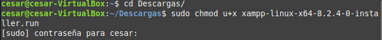
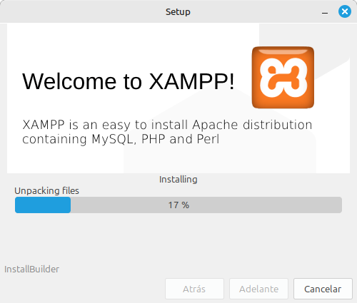

# Instalación de Xamp.

#### 1. Descargar el instalador de Xamp en su página oficial.

---

 

#### 2. Ejecutar el ejecutable descargado anteriormente.
Para poder ejecutar el archivo necesitaremos darle permisos de ejecución. Se hará uso del chmod u+x al archivo.

sudo chmod u+x xampp-linux-x64-8.2.4-0-installer.run 

Se procede a ejecutarlo. Debemos esperar que termine de ejecutarse.

