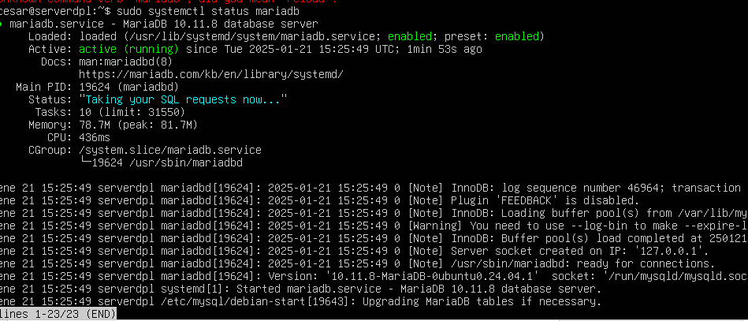
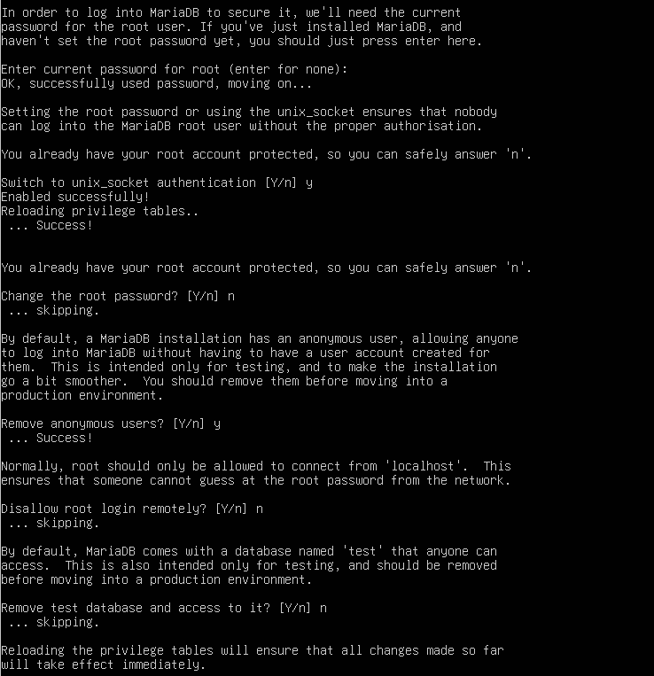
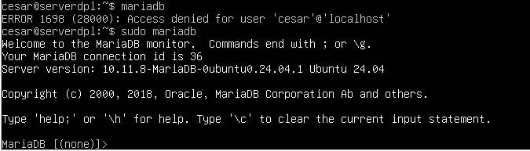
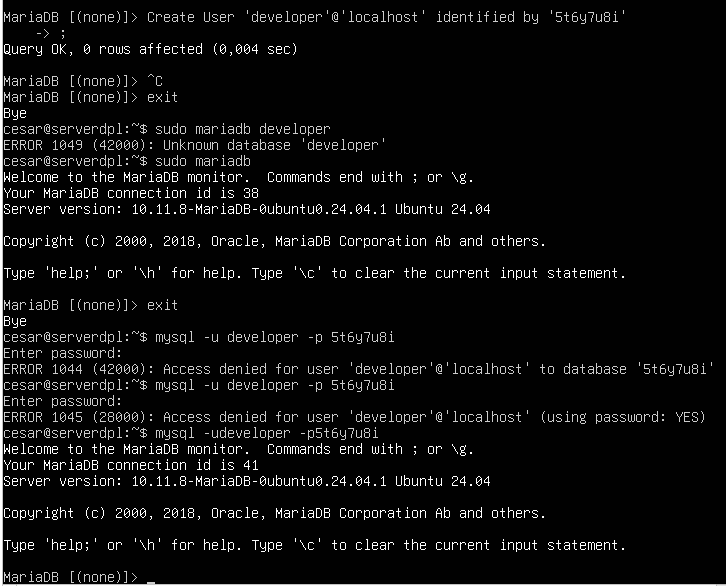
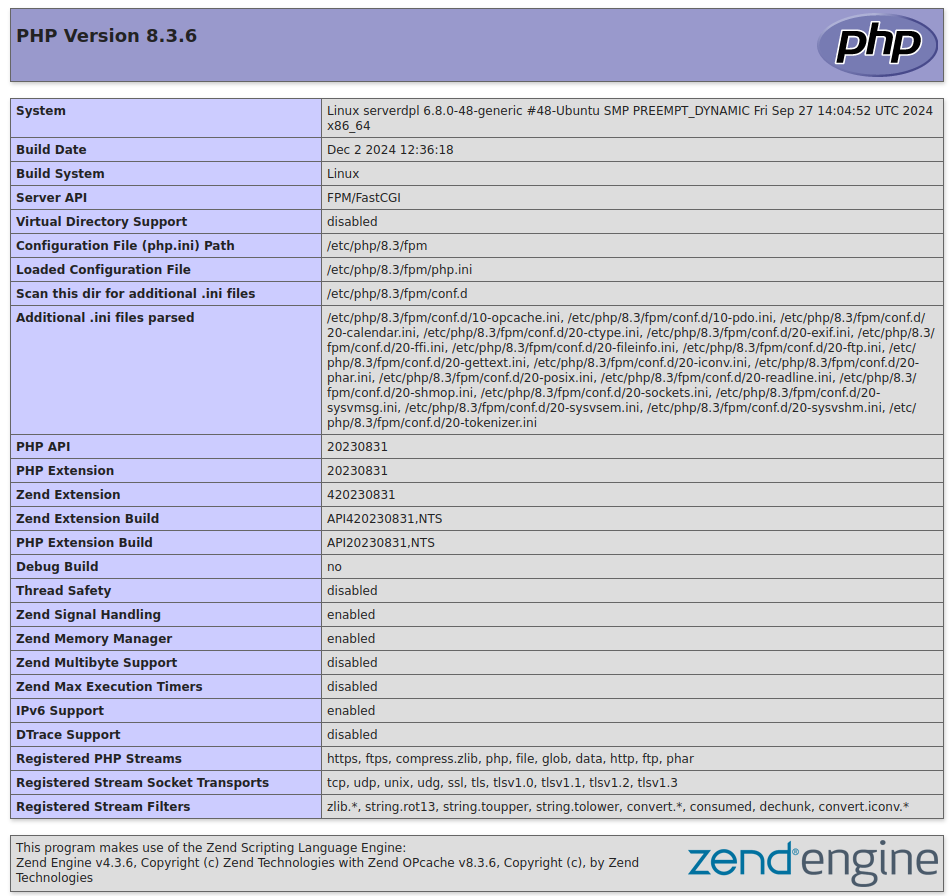

# Guía de Instalación de Apache en Ubuntu


## Paso 1: Actualizar el Índice de Paquetes


Para comenzar, es importante actualizar el índice de paquetes locales para reflejar los últimos cambios. Ejecuta el siguiente comando:


```bash

sudo apt update

```

A continuación, instala el paquete apache2:

```bash

sudo apt install apache2
```
Confirmación de Instalación: Una vez que confirmes la instalación, apt instalará Apache junto con todas las dependencias necesarias.

Paso 2: Ajustar el Firewall

Antes de probar Apache, es necesario modificar los ajustes del firewall para permitir el acceso externo a los puertos web predeterminados. Si has seguido las instrucciones de los requisitos previos, deberías tener un firewall UFW configurado.
Listar Perfiles de Aplicación UFW

Para habilitar o deshabilitar el acceso a Apache a través del firewall, primero enumera los perfiles de aplicación:

```bash

sudo ufw app list
```
Resultados Esperados

Deberías obtener una lista de los perfiles de aplicación:

Available applications:

  Apache

  Apache Full

  Apache Secure

  OpenSSH

Habilitar el Perfil de Apache

Se recomienda habilitar el perfil más restrictivo. Dado que aún no hemos configurado SSL, solo permitiremos el tráfico en el puerto 80:

```bash

sudo ufw allow 'Apache'
```
Verificar Cambios en el Firewall

Para verificar que el cambio se ha realizado correctamente, ejecuta:

```bash

sudo ufw status
```
Resultados Esperados

Deberías ver algo como esto:

Status: active


To                         Action      From

--                         ------      ----

OpenSSH                    ALLOW       Anywhere                  

Apache                     ALLOW       Anywhere                

OpenSSH (v6)               ALLOW       Anywhere (v6)             

Apache (v6)                ALLOW       Anywhere (v6)

Paso 3: Comprobar el Servidor Web

Al final del proceso de instalación, Apache debería estar activo. Verifica el estado del servicio con:

```bash

sudo systemctl status apache2
```
Resultados Esperados

Deberías ver un resultado similar a:

● apache2.service - The Apache HTTP Server

     Loaded: loaded (/lib/systemd/system/apache2.service; enabled; vendor preset: enabled)

     Active: active (running) since Thu 2020-04-23 22:36:30 UTC; 20h ago

       Docs: https://httpd.apache.org/docs/2.4/

   Main PID: 29435 (apache2)

      Tasks: 55 (limit: 1137)

     Memory: 8.0M

     CGroup: /system.slice/apache2.service

             ├─29435 /usr/sbin/apache2 -k start

             ├─29437 /usr/sbin/apache2 -k start

             └─29438 /usr/sbin/apache2 -k start

Acceder a la Página de Apache

Para confirmar que el software funciona correctamente, accede a la página de destino predeterminada de Apache mediante tu dirección IP. Si no conoces la dirección IP de tu servidor, puedes obtenerla con:

```bash

hostname -I
```
O usando:

```bash

curl -4 icanhazip.com
```
Introduce la dirección IP en la barra de direcciones de tu navegador:

http://your_server_ip

Paso 4: Instalación de MariaDB
Instalación del Servidor de Base de Datos

Para instalar MariaDB, ejecuta:

```bash

sudo apt install mariadb-server mariadb-client
```
    Verificar el Estado de MariaDB: Después de la instalación, el servidor MariaDB debería ejecutarse automáticamente. Verifica su estado con:

```bash

sudo systemctl status mariadb
```
Habilitar MariaDB en el Arranque

Para permitir que MariaDB se inicie automáticamente al arrancar, ejecuta:

```bash

sudo systemctl enable mariadb
```
Verificar la Versión de MariaDB

Para verificar la versión instalada, utiliza:

```bash

mysql --version
```
Configuración de Seguridad de MariaDB

Ejecuta el script de seguridad posterior a la instalación:

```bash

sudo mysql_secure_installation
```
    Configuración de Contraseña: Cuando se te pida, presiona Intro para la contraseña root (aún no configurada) y luego establece tu nueva contraseña.

Acceso a la Base de Datos

Prueba el acceso a la base de datos con la nueva contraseña:

```bash

mysql -u root -p
```
Crear un Nuevo Usuario

Para crear un nuevo usuario llamado developer con la contraseña 5t6y7u8i, utiliza los siguientes comandos:

```sql

CREATE USER 'developer'@'localhost' IDENTIFIED BY '5t6y7u8i';

GRANT ALL PRIVILEGES ON *.* TO 'developer'@'localhost' WITH GRANT OPTION;

FLUSH PRIVILEGES;
```
Capturas de Pantalla

Paso 5: Instalación de PHP
Instalación de PHP y Módulos Comunes

Para instalar PHP y algunos módulos comunes, ejecuta:

```bash

sudo apt install php7.4 libapache2-mod-php7.4 php7.4-mysql php-common php7.4-cli php7.4-common php7.4-json php7.4-opcache php7.4-readline
```
Activar el Módulo PHP

Activa el módulo PHP para Apache y reinicia el servidor web:

```bash

sudo a2enmod php7.4

sudo systemctl restart apache2
```
Verificar la Versión de PHP

Para verificar la versión de PHP instalada, utiliza:

```bash

php --version
```
Crear un Archivo de Información PHP

Para probar los scripts PHP con el servidor Apache, crea un archivo info.php en el directorio raíz:

```bash

sudo vim /var/www/html/info.php
```
Dentro del archivo, pega el siguiente código PHP:

```php

<?php phpinfo(); ?>
```
Acceder a la Página de Información PHP

Introduce la dirección IP de tu servidor seguida de /info.php en la barra de direcciones de tu navegador:

http://your_server_ip/info.php


Paso 6: Ejecutar Código PHP en Apache
Usar PHP-FPM

Si necesitas ejecutar código PHP con PHP-FPM, primero deshabilita el módulo Apache PHP:

```bash

sudo a2dismod php7.4
```
Luego, instala PHP-FPM:

```bash

sudo apt install php7.4-fpm
```
Habilitar Módulos Necesarios

Habilita los módulos proxy_fcgi y setenvif:

```bash

sudo a2enmod proxy_fcgi setenvif
```
Habilitar la Configuración de PHP-FPM

Habilita el archivo de configuración de PHP-FPM:

```bash

sudo a2enconf php7.4-fpm
```
Reiniciar Apache

Reinicia Apache para aplicar los cambios:

```bash

sudo systemctl restart apache2
```
Verificar el Cambio en la Página de Información PHP

Actualiza la página info.php en el navegador y verifica que la API del servidor haya cambiado de Apache 2.0 Handler a FPM/FastCGI.

Paso 7: Capturas de Pantalla de la Carpeta de Imágenes









